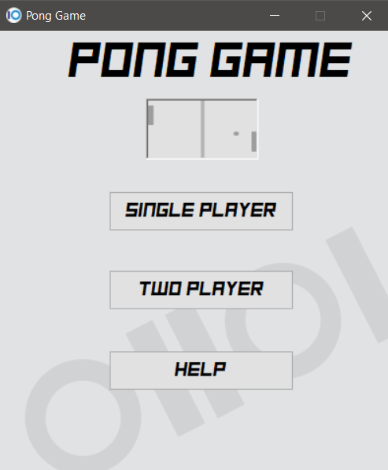
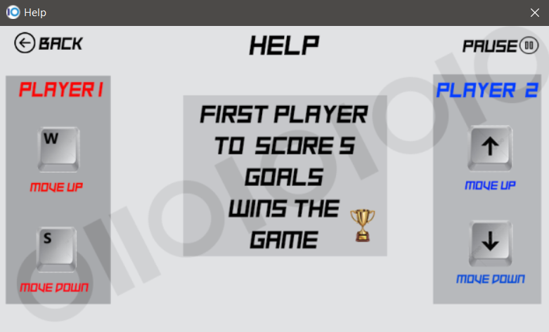
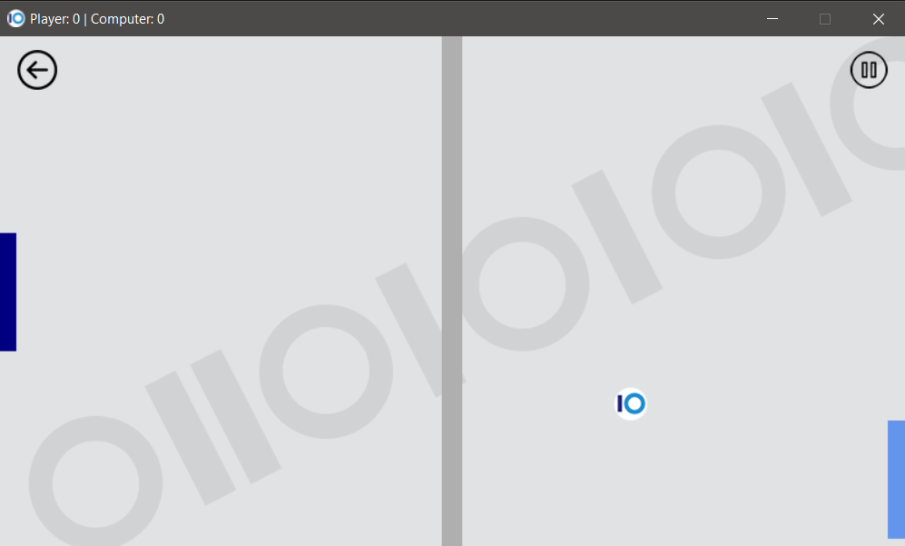
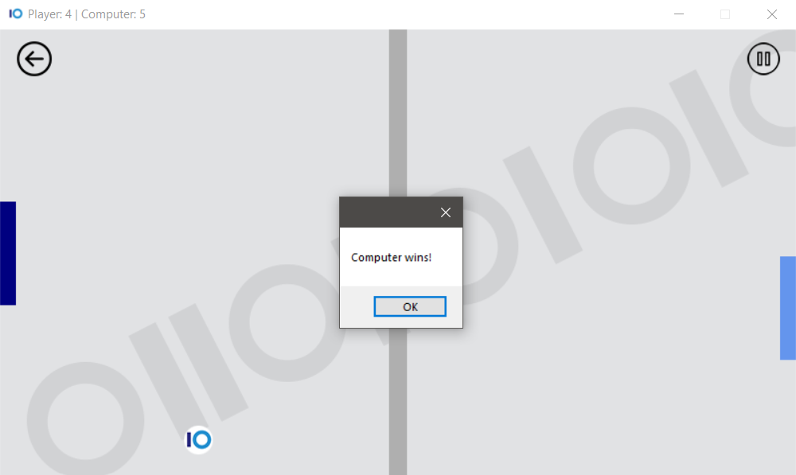

# Pong Game

Windows Forms Project by: Strasho Naumov and Leonid Stojkovski

---

### *Македонски* / English
### 1. Опис на апликацијата

 Се работи за игра наречена Pong Game, каде што со помош на панели се удира фудбалска топка и целта е да се постигне гол, оној кој прв ќе постигне 5 голови, победува.
 Играта може да се игра против компјутер или против друг играч.

### 2. Упатство за користење

#### 2.1. Нова игра

На почетниот прозорец при стартување на апликацијата имаме можност да избереме игра против компјутерот или игра за двајца, како и Help дел каде детално ни се објаснети правилата и контролите на играта.

### 3. Претставување на проблемот

#### 3.1 Податочни структури

Главните податоци и функции се чуваат во класата <code> Menu </code>

##### 3.1.1 Help

Со оваа класа го дефинираме Help прозорецот кој овозможува објаснување на играчот кои контроли треба да се користат за движење на панелите, колку голови се потребни за да имаме победник, како и каде треба да притиснеме за да ја паузираме играта.

##### 3.1.2 SinglePlayer

Со оваа класа се дефинира целото дејство на играта кога играме против компјутерот, односно брзината и начинот на движење на панелите, однесувањето на топката, броењето резултат и сите останати функционалности во главниот дел на играта. 

##### 3.1.3 Twoplayer

Со оваа класа се претставува делот кој што овозможува игра за двајца, односно ни се овозможува игра каде што ќе играте со вашиот пријател а не против компјутерот, а правилата остануваат исти како и во другиот мод, т.е играта ќе заврши кога еден од играчите ќе постигне 5 голови. 

#### 3.2 Алгоритми

<code>timer_Tick()</code> - оваа функција го контролира текот на играта. Тука ги имаме функциите кои ја генерираат топката на рандом место, ја контролираат брзината, правецот и насоката на топката, контролира каде завршила топката по постигнатиот гол, ги брои головите на играчите, и кога ќе се постигнат 5 гола ја прекинува играта и соопштува кој играч победил на натпреварот.

<code>SinglePlayer_KeyUp()</code> - со оваа функција се дефинира движењето на палките, односно со притискање на копчињата нагоре и надолу палката се движи соодветно се додека не удри во некој од ѕидовите.

<code>pbSPplay_Click()</code> и <code>pbSPause_Click()</code> - функции за стартување односно за паузирање на играта, со нивните соодветни функции за отпочнување на играта и затворање на играта.

<code>timer1_tick()</code> - функција во класата Тwo player прототип на <code>timer_Tick()</code> со тоа што е додадена функционалност за палката на играч 2.

<code>TwoPlayer_KeyUp()</code> - со оваа функција се дефинира движење на палките и нивните соодветни копчиња нагоре и надоле (W, S или стрелка нагоре и стрелка надоле)

---

 ### Македонски / *English*
 ### 1. Description 
 This application that we are developing is named Pong Game. There are two pannels that are controlled by the player/players and the purpose is to score goals by hitting the ball. First player that scores 5 goals wins the game. It can be played solo (against PC) or in two player mode against another player.

 
### 2. How to play 
#### 2.1 New Game 
 
On the main window you have the ability to start a *New Game* against the PC, to start a game for *Two Players*, or to view the *Help* window for game details.

## License 

This program is free software: you can redistribute it and/or modify it under the terms of the GNU General Public License as published by the Free Software Foundation, either version 3 of the License, or (at your option) any later version.

This program is distributed in the hope that it will be useful, but WITHOUT ANY WARRANTY; without even the implied warranty of MERCHANTABILITY or FITNESS FOR A PARTICULAR PURPOSE. See the GNU General Public License for more details.
